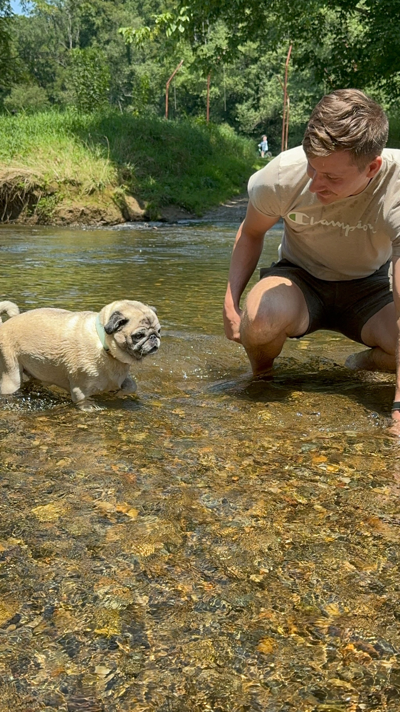

# Nicholas Schrum

-------

### EDUCATION
Appalachian State University 
Bachelor of Science in [Community and Regional Planning](https://www.appstate.edu/academics/majors/id/community-regional-planning) and Sustainable Devleopment 

### SKILLS
- Able to gathher, interpret, and map geographic information effectively 
- Strong Background in Urban Planning
- Data research, process, and analysis
- ArcGIS Pro, ENVI, Adobe Illustrator, QGIS and Geospatial 
- Forklift certified
### EXPERIENCE
**Empower**
- coordinating site suitability analyisis
- Responisible for coordinating with team of engineers and project managers
- Adhereing to Local state and federal codes and legislation

**Lowes Hardware**
- Trained and supervised a team three people
- inreased sales through interactions with vendors and contractors 
- Provide information and assist local homeowners 

